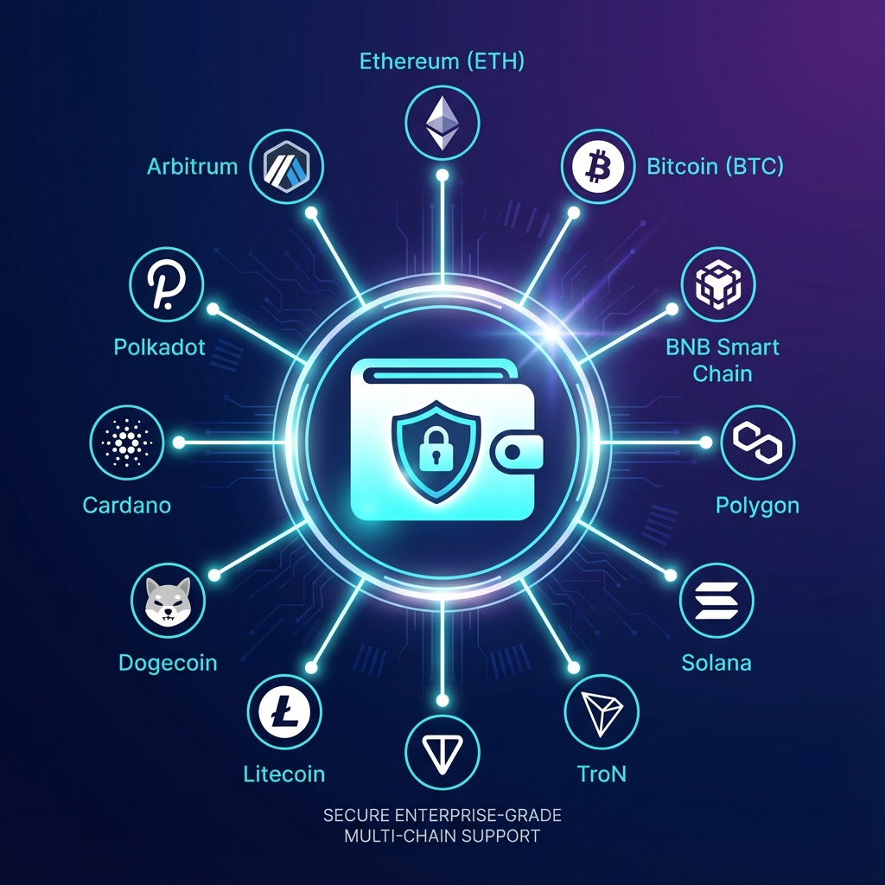
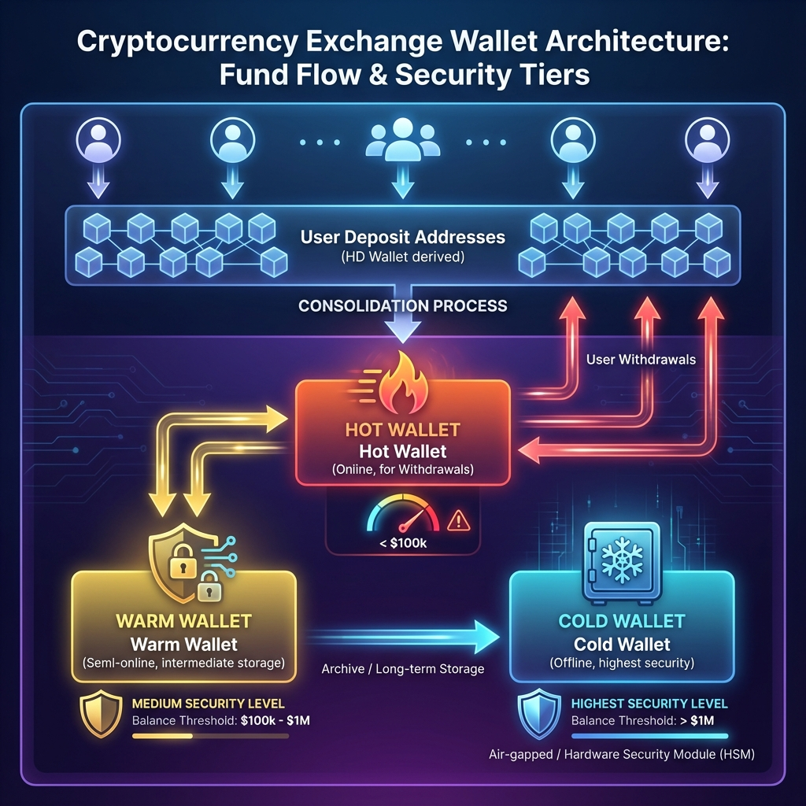
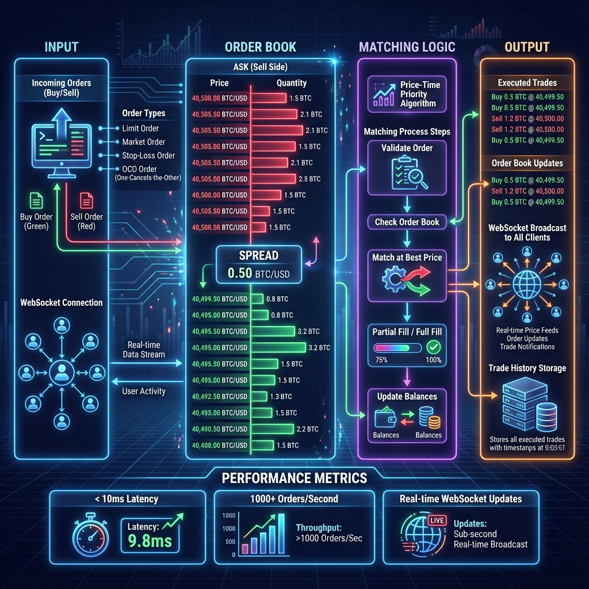
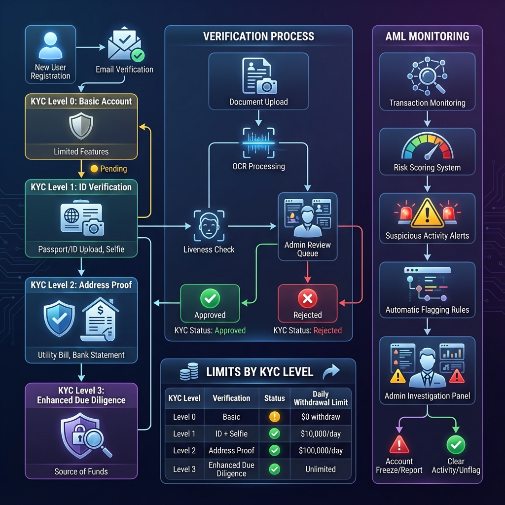
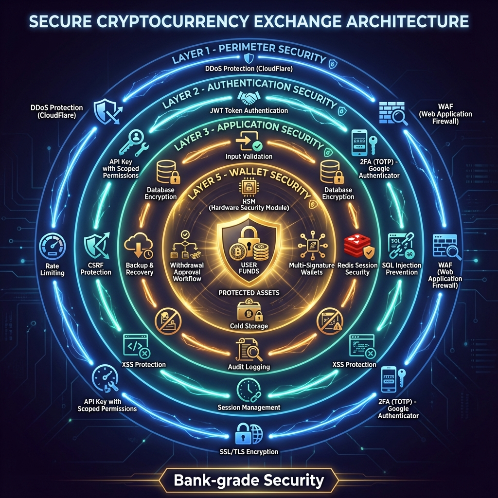
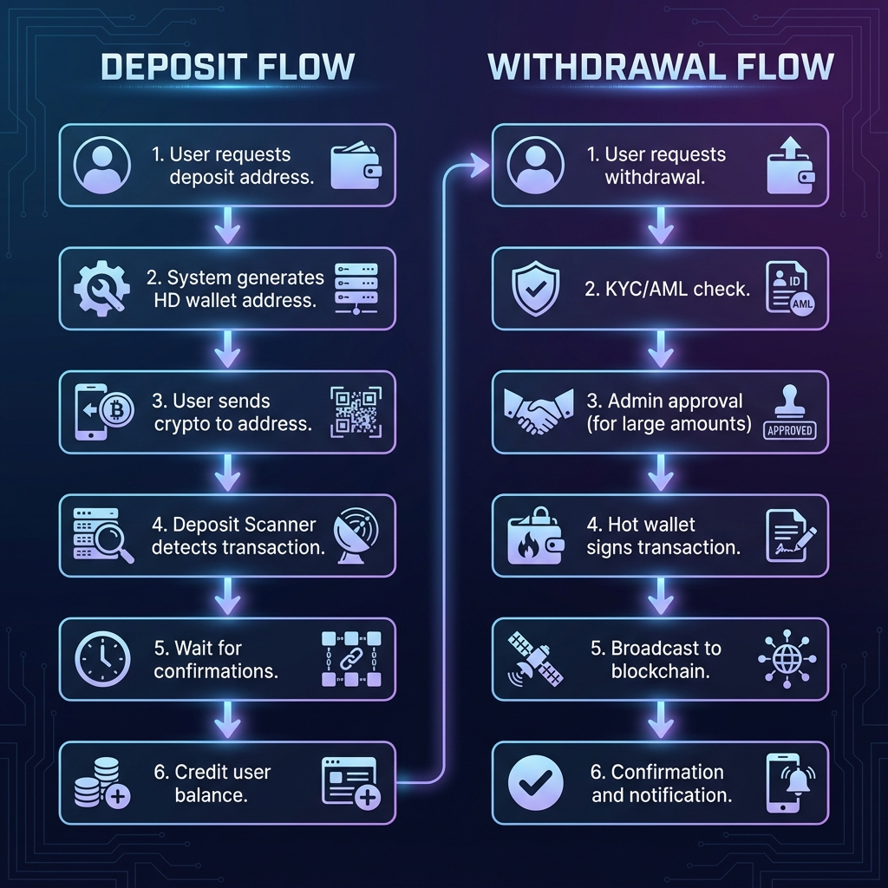

<!-- System Architecture Banner -->

# CEX Web3 Exchange Platform

**Enterprise-Grade Cryptocurrency Exchange Infrastructure**

**English** | 🌐 [繁體中文](./README.zh-TW.md)

[🚀 Live Demo](#-live-demo) • [📱 Download APK](#-download-apk) • [💼 Commercial License](#-commercial-license) • [📖 Documentation](#-documentation)

---

## ⚠️ Important Disclaimer

> **READ BEFORE USE**
> 
> This software is provided **"AS IS"** without warranty of any kind. The authors are **NOT** operating a cryptocurrency exchange and are **NOT** responsible for how this software is used.
> 
> **If you operate a service using this software, YOU are solely responsible for:**
> - Obtaining required licenses and permits
> - Implementing AML/KYC compliance
> - Safeguarding user funds
> - All legal and regulatory obligations
>
> See [LEGAL_DISCLAIMER.md](./LEGAL_DISCLAIMER.md) for full details.

---

## ✨ Features

<table>
<tr>
<td width="50%">

### 🔐 High-Performance Trading Engine
- Real-time order matching via WebSocket
- Multiple order types: Limit, Market, Stop-Loss, OCO
- Order book with depth visualization
- Sub-second trade execution

</td>
<td width="50%">

### 💼 Multi-Chain Wallet System
- **10+ Blockchains Supported**
- EVM: Ethereum, BSC, Polygon, Arbitrum
- UTXO: Bitcoin, Litecoin, Dogecoin
- Others: Solana, Tron, TON, Cardano, Polkadot
- HD Wallet derivation for user addresses

</td>
</tr>
<tr>
<td>

### 🛡️ Security & Compliance
- KYC/AML verification system
- Two-Factor Authentication (TOTP)
- Withdrawal approval workflow
- Rate limiting & DDoS protection
- Comprehensive audit logging

</td>
<td>

### 📱 Cross-Platform Applications
- **Web**: Next.js 15 trading interface
- **Mobile**: Flutter iOS & Android apps
- **Admin**: Management dashboard
- **API**: RESTful + WebSocket for algo trading

</td>
</tr>
</table>

---

## 🏗️ System Architecture

### Architecture Overview

**CEX Web3 Platform** is built on a modular microservices architecture:

| Layer | Description |
|-------|-------------|
| **Client Layer** | Web (Next.js), Mobile (Flutter), Admin Dashboard |
| **API Gateway** | NestJS REST API + WebSocket for real-time updates |
| **Core Services** | Auth, Trading Engine, Wallet, KYC/AML, Deposits/Withdrawals |
| **Data Layer** | PostgreSQL (persistent), Redis (cache/sessions) |
| **Blockchain Layer** | 12+ chain integrations via abstracted providers |

---

## 💹 Trading Flow

### How Orders Are Processed

1. **Order Submission** → User places Buy/Sell order via API or WebSocket
2. **Validation** → System checks balance, rate limits, and risk controls
3. **Matching Engine** → Real-time order book matching algorithm
4. **Trade Execution** → Matched orders are settled, balances updated atomically
5. **Notification** → Real-time WebSocket push to all connected clients

---

## 💼 Multi-Chain Wallet

### Supported Chains

Our wallet system supports **12+ blockchains** with unified HD wallet derivation:

| Chain | Type | Tokens | Status |
|-------|------|--------|--------|
| **Ethereum** | EVM | ETH, ERC-20 | ✅ Production Ready |
| **BNB Smart Chain** | EVM | BNB, BEP-20 | ✅ Production Ready |
| **Polygon** | EVM | MATIC, ERC-20 | ✅ Production Ready |
| **Arbitrum** | EVM | ETH, ERC-20 | ✅ Production Ready |
| **Bitcoin** | UTXO | BTC | ✅ Production Ready |
| **Litecoin** | UTXO | LTC | ✅ Production Ready |
| **Dogecoin** | UTXO | DOGE | ✅ Production Ready |
| **Solana** | Account | SOL, SPL | ✅ Production Ready |
| **Tron** | Account | TRX, TRC-20 | ✅ Production Ready |
| **TON** | Account | TON, Jettons | ✅ Production Ready |
| **Cardano** | UTXO | ADA | ✅ Production Ready |
| **Polkadot** | Account | DOT | ✅ Production Ready |

---

## 🏦 Wallet Security Architecture

### Fund Management Tiers

| Tier | Purpose | Security Level |
|------|---------|----------------|
| **Hot Wallet** | Instant withdrawals | Online, < $100k |
| **Warm Wallet** | Replenishment buffer | Semi-online, $100k-$1M |
| **Cold Wallet** | Long-term storage | Offline/HSM, > $1M |

**Consolidation Process**: User deposits are automatically consolidated into hot wallet for efficient fund management.

---

## ⚙️ Matching Engine

### Performance Features
- **< 10ms** order matching latency
- **Price-Time Priority** algorithm
- **Real-time** WebSocket order book updates
- Support for **Limit, Market, Stop-Loss, OCO** orders

---

## 🛡️ KYC/AML Compliance

### Verification Levels

| Level | Requirements | Daily Limit |
|-------|-------------|-------------|
| **Level 0** | Email only | $0 (view only) |
| **Level 1** | ID + Selfie | $10,000 |
| **Level 2** | Address proof | $100,000 |
| **Level 3** | Source of funds | Unlimited |

---

## 🔒 Security Architecture

### Multi-Layer Protection
- **Perimeter**: DDoS protection, WAF, Rate limiting
- **Authentication**: JWT, 2FA (TOTP), API keys with scoped permissions
- **Application**: Input validation, SQL injection prevention, XSS/CSRF protection
- **Data**: Encryption at rest, Audit logging, Backup & recovery
- **Wallet**: HSM, Multi-sig, Cold storage, Withdrawal approval workflow

## 💰 Deposit & Withdrawal Flow

### Deposit Process
1. User requests deposit address → System generates unique HD wallet address
2. User sends crypto → Deposit Scanner monitors blockchain
3. Transaction confirmed → Balance credited automatically

### Withdrawal Process
1. User requests withdrawal → KYC/AML verification
2. Large amounts → Admin approval required
3. Hot wallet signs transaction → Broadcast to blockchain
4. Confirmation → User notified via push/email

---

### Web Application

### Mobile Application

  
  
  
  
  

### Admin Dashboard

---

## 🚀 Live Demo

| Platform | Link | Status |
|----------|------|--------|
| 🌐 Web App | [cex-web3-demo.vercel.app](https://web-7s72eqotu-aa22396584-6131s-projects.vercel.app) | ✅ Live |
| 📡 Backend API | [backend-production-ae3a.up.railway.app](https://backend-production-ae3a.up.railway.app/api) | ✅ Live |

---

## 📱 Download APK

> ⚠️ **Demo Mode**
> 
> The demo backend is deployed with **省錢模式 (Cost-Saving Mode)**:
> - Lazy Scanning: Blockchain scanning is triggered on-demand
> - Testnet Only: Sepolia network for EVM chains
> - No real funds are at risk
>
> **Full features available:**
> - User registration & login
> - Wallet address generation
> - Balance checking (triggers lazy scan)
> - Order placement & trading

| Platform | Download | Version | Status |
|----------|----------|---------|--------|
| Android | [📥 Download APK](https://github.com/ImL1s/cex-web3-showcase/releases/download/v1.1.0/cex-web3-showcase-v1.1.0.apk) | v1.1.0 | ✅ Connected to Live Backend |
| iOS | TestFlight (Coming Soon) | - | 🔜 |

---

## 🛠️ Tech Stack

| Layer | Technologies |
|-------|--------------|
| **Backend** | NestJS 11, TypeScript 5, Prisma ORM, PostgreSQL, Redis |
| **Web/Admin** | Next.js 15, React 19, Tailwind CSS, TanStack Query |
| **Mobile** | Flutter 3.x, Riverpod, go_router |
| **Blockchain** | ethers.js v6, @solana/web3.js, bitcoinjs-lib, tronweb |
| **Infrastructure** | Docker, GitHub Actions, Vercel |

---

## 📖 Documentation

| Document | Description |
|----------|-------------|
| [Architecture](./docs/ARCHITECTURE.md) | System design and module breakdown |
| [API Examples](./docs/API_EXAMPLES.md) | REST and WebSocket API usage |
| [Deployment Guide](./docs/DEPLOYMENT.md) | Production deployment checklist |

---

## 💼 Commercial License

This project is dual-licensed:

| License | Use Case | Price |
|---------|----------|-------|
| **AGPL-3.0** | Open source use (modifications must be shared) | Free |
| **Commercial** | Proprietary use, white-label solutions | Contact for pricing |

### Interested in Commercial License?

📧 **Email**: [aa22396584@gmail.com](mailto:aa22396584@gmail.com)

**What's Included:**
- ✅ Full source code access
- ✅ Private repository access
- ✅ Deployment support
- ✅ 90 days technical support
- ✅ Custom feature development (optional)

---

## ⚖️ License

This project is licensed under the **GNU Affero General Public License v3.0 (AGPL-3.0)**.

See [LICENSE](./LICENSE) for full license text.

See [LEGAL_DISCLAIMER.md](./LEGAL_DISCLAIMER.md) for important legal information.

---

## 🔒 Security

For security vulnerabilities, please email: [security@cex-web3.io](mailto:security@cex-web3.io)

**Do NOT open public issues for security vulnerabilities.**

---

**Built with ❤️ for the crypto community**

[⬆ Back to Top](#cex-web3-exchange-platform)

