

<!-- System Architecture Banner -->
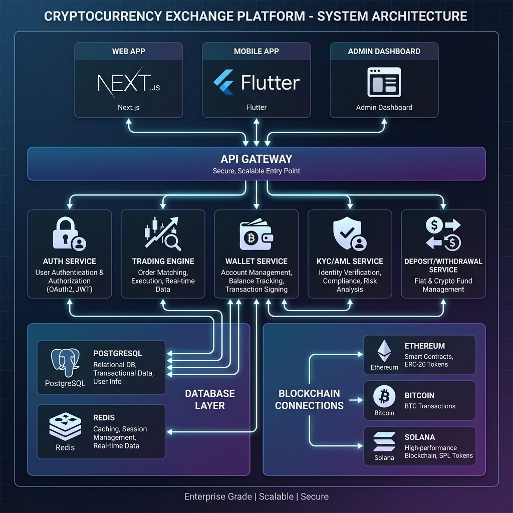

# CEX Web3 交易所平台

**企業級加密貨幣交易所基礎設施**

🌐 [English](./README.md) | **繁體中文**

[🚀 線上演示](#-線上演示) • [📱 下載 APK](#-下載-apk) • [💼 商業授權](#-商業授權) • [📖 文件](#-文件)

---

## ⚠️ 重要聲明

> **使用前請詳閱**
> 
> 本軟體以 **「現狀」** 提供，不附帶任何形式的擔保。作者**並未**經營加密貨幣交易所，且**不**對本軟體的使用方式負責。
> 
> **如果您使用本軟體營運服務，您需獨自承擔以下責任：**
> - 取得必要的執照和許可證
> - 實施 AML/KYC 合規措施
> - 保障用戶資金安全
> - 所有法律和監管義務
>
> 詳見 [LEGAL_DISCLAIMER.zh-TW.md](./LEGAL_DISCLAIMER.zh-TW.md)。

---

## ✨ 功能特色

<table>
<tr>
<td width="50%">

### 🔐 高效能交易引擎
- 透過 WebSocket 進行即時訂單撮合
- 多種訂單類型：限價、市價、止損、OCO
- 訂單簿深度視覺化
- 毫秒級交易執行

</td>
<td width="50%">

### 💼 多鏈錢包系統
- **支援 10+ 區塊鏈**
- EVM：以太坊、BSC、Polygon、Arbitrum
- UTXO：比特幣、萊特幣、狗狗幣
- 其他：Solana、Tron、TON、Cardano、Polkadot
- 用戶地址 HD 錢包推導

</td>
</tr>
<tr>
<td>

### 🛡️ 安全與合規
- KYC/AML 驗證系統
- 雙因素認證（TOTP）
- 提現審批流程
- 速率限制 & DDoS 防護
- 完整審計日誌

</td>
<td>

### 📱 跨平台應用
- **Web**：Next.js 15 交易介面
- **行動裝置**：Flutter iOS & Android 應用
- **管理後台**：管理控制面板
- **API**：RESTful + WebSocket 支援演算法交易

</td>
</tr>
</table>

---

### Web 網頁應用

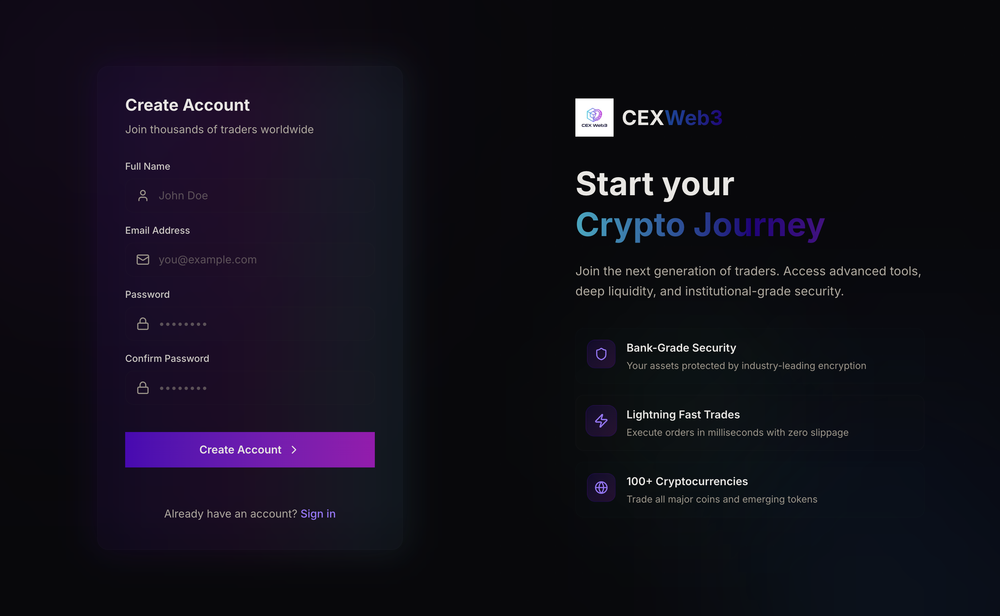

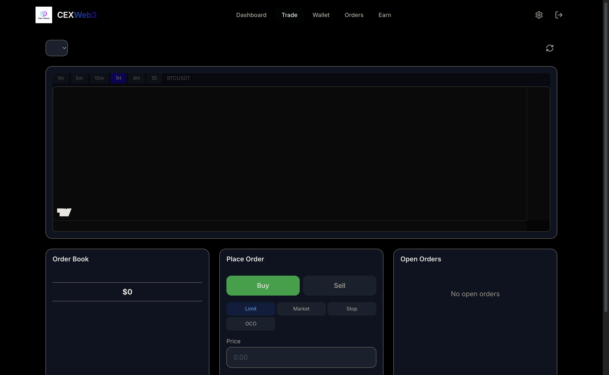

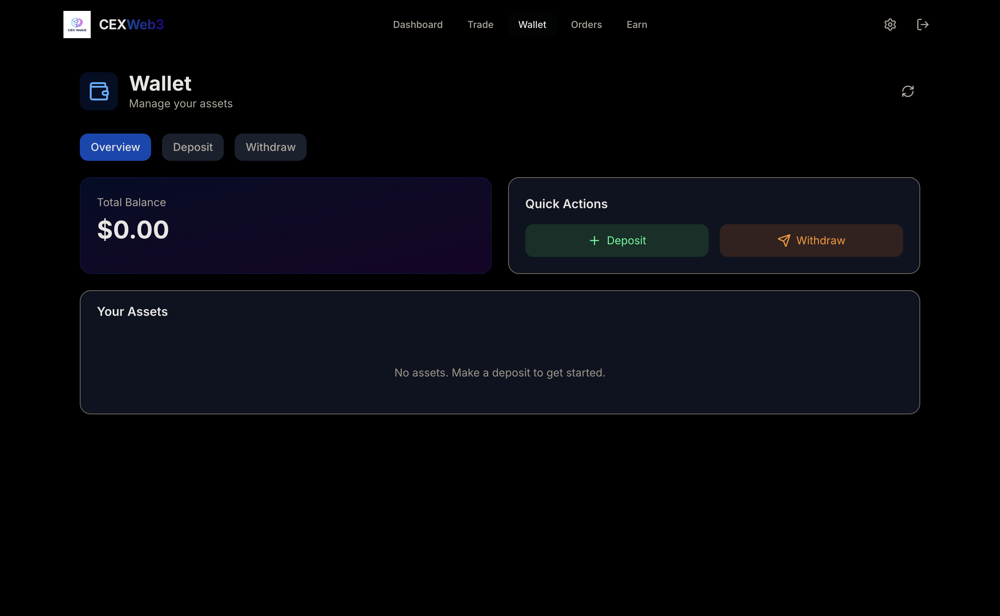

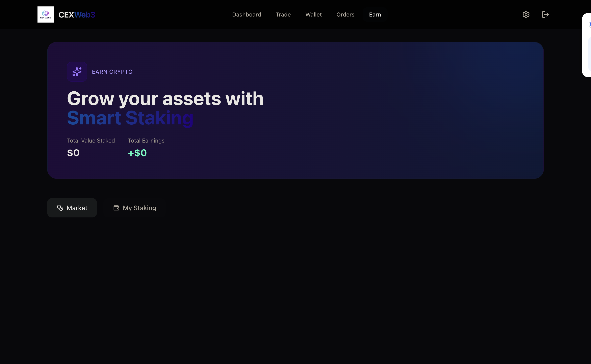

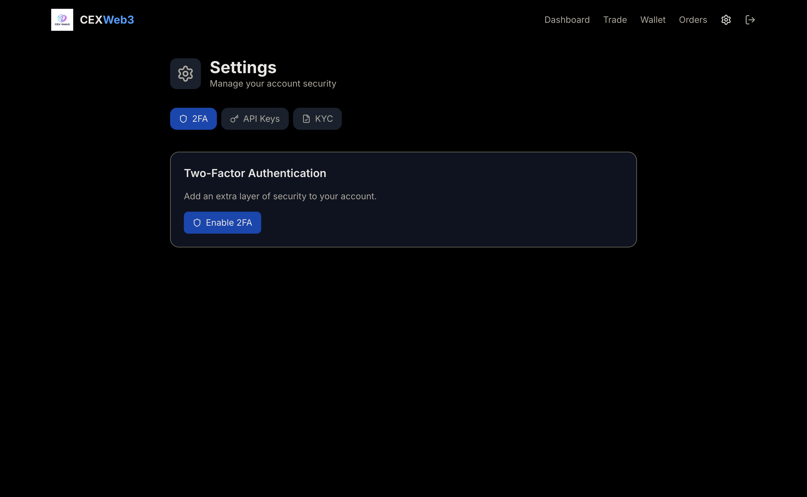

### Mobile 行動應用

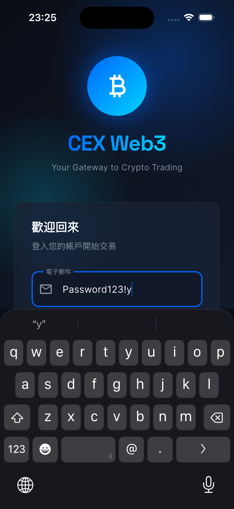

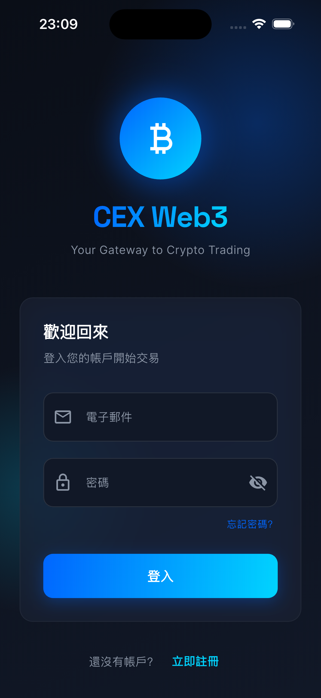

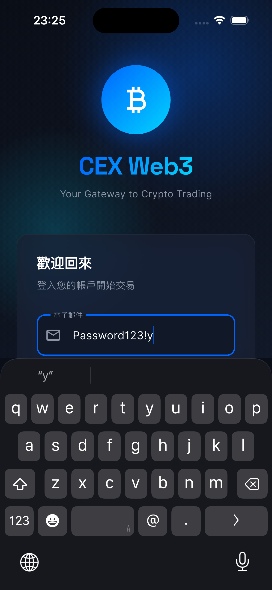

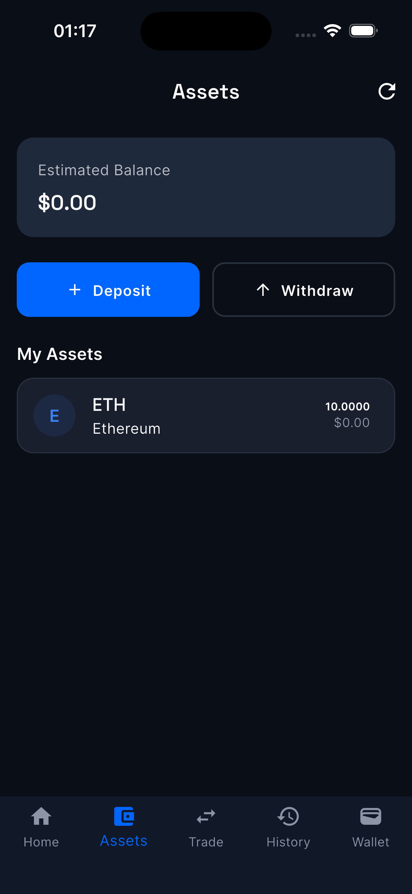

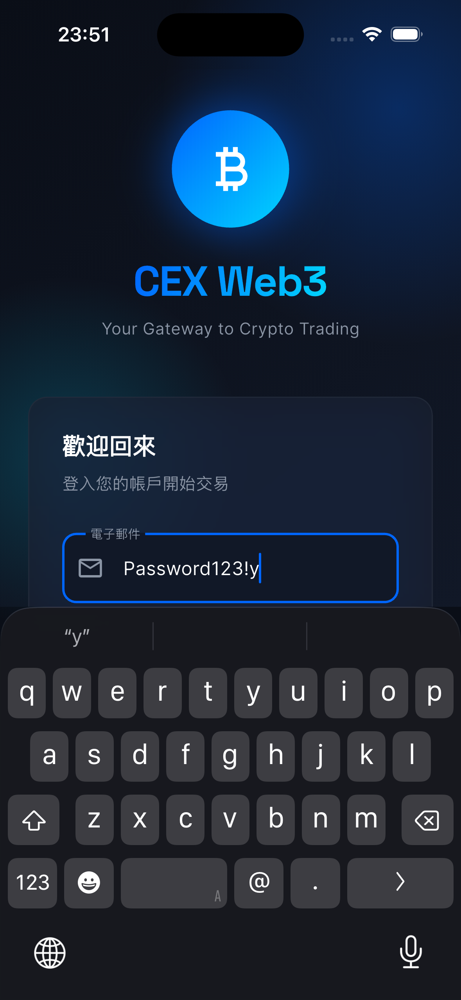

### Admin 管理者後台

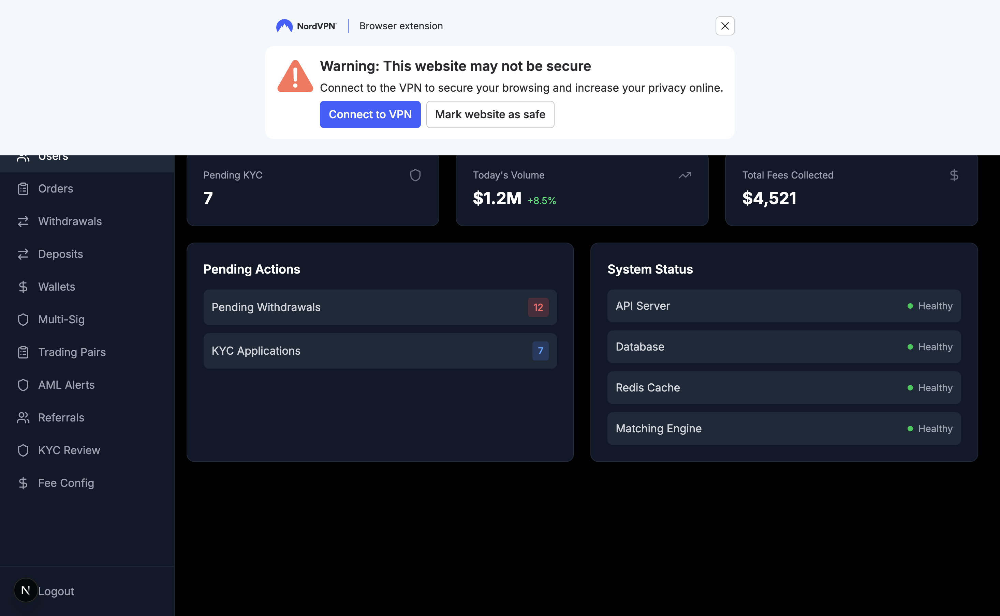

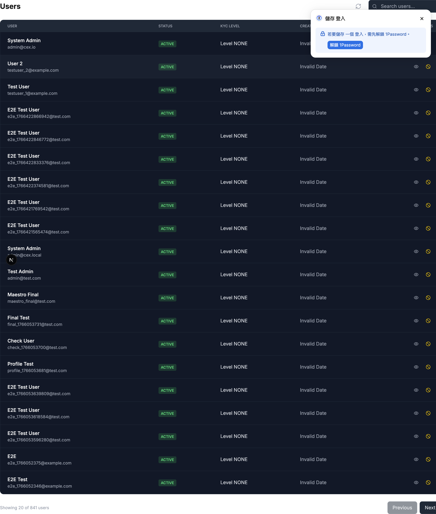

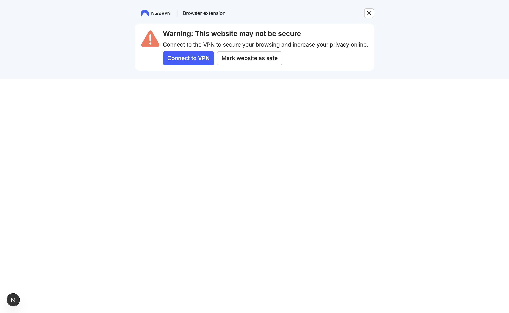

---

## 🚀 線上演示

| 平台 | 連結 | 狀態 |
|------|------|------|
| 🌐 網頁應用 | [cex-web3-demo.vercel.app](https://web-7s72eqotu-aa22396584-6131s-projects.vercel.app) | ✅ 上線中 |
| 📡 後端 API | [backend-production-ae3a.up.railway.app](https://backend-production-ae3a.up.railway.app/api) | ✅ 上線中 |

---

## 📱 下載 APK

> ✅ **演示後端已上線**
> 
> APK 已配置連接至我們的 **Railway 生產環境後端**。
> 您現在可以測試完整的端到端功能，包括登入、交易和錢包管理。
> 
> **測試帳號：**
> - 電子郵件：`test_curl_1@cex.com`
> - 密碼：`Password123!`
> 
> **可探索功能：**
> - ✅ 即時價格更新（ETH/BTC）
> - ✅ 資產餘額同步（已預存 10 ETH）
> - ✅ 下單和導航
> - ✅ 提現表單連接
>
> **有興趣了解商業演示？** 請聯繫 aa22396584@gmail.com

| 平台 | 下載 | 版本 | 狀態 |
|------|------|------|------|
| Android | [📥 下載 APK](https://github.com/ImL1s/cex-web3-showcase/releases/download/v1.1.0/cex-web3-showcase-v1.1.0.apk) | v1.1.0 | ✅ 完整功能 |
| iOS | TestFlight（即將推出） | - | 🔜 |

---

## 🛠️ 技術棧

| 層級 | 技術 |
|------|------|
| **後端** | NestJS 11、TypeScript 5、Prisma ORM、PostgreSQL、Redis |
| **網頁/管理後台** | Next.js 15、React 19、Tailwind CSS、TanStack Query |
| **行動裝置** | Flutter 3.x、Riverpod、go_router |
| **區塊鏈** | ethers.js v6、@solana/web3.js、bitcoinjs-lib、tronweb |
| **基礎設施** | Docker、GitHub Actions、Vercel |

---

## 📖 文件

| 文件 | 說明 |
|------|------|
| [架構說明](./docs/ARCHITECTURE.zh-TW.md) | 系統設計和模組分解 |
| [API 範例](./docs/API_EXAMPLES.zh-TW.md) | REST 和 WebSocket API 使用說明 |
| [部署指南](./docs/DEPLOYMENT.md) | 生產部署檢查清單 |

---

## 💼 商業授權

本專案採用雙重授權：

| 授權 | 使用場景 | 價格 |
|------|----------|------|
| **AGPL-3.0** | 開源使用（修改必須共享） | 免費 |
| **商業授權** | 專有使用、白標解決方案 | 聯繫詢價 |

### 有興趣取得商業授權？

📧 **電子郵件**：[aa22396584@gmail.com](mailto:aa22396584@gmail.com)

**包含內容：**
- ✅ 完整原始碼存取
- ✅ 私人倉庫存取權限
- ✅ 部署支援
- ✅ 90 天技術支援
- ✅ 客製功能開發（選配）

---

## ⚖️ 授權

本專案採用 **GNU Affero 通用公共授權條款第 3 版（AGPL-3.0）**。

詳見 [LICENSE](./LICENSE) 取得完整授權條款。

詳見 [LEGAL_DISCLAIMER.zh-TW.md](./LEGAL_DISCLAIMER.zh-TW.md) 取得重要法律資訊。

---

## 🔒 安全

如有安全漏洞，請發送電子郵件至：[aa22396584@gmail.com](mailto:aa22396584@gmail.com)

**請勿為安全漏洞建立公開 Issue。**

---

**用 ❤️ 為加密社群打造**

[⬆ 返回頂部](#cex-web3-交易所平台)

